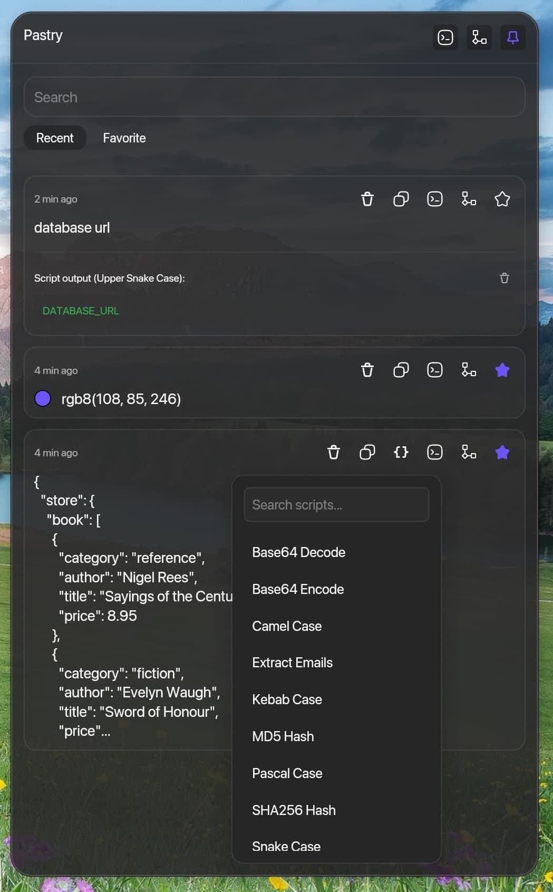
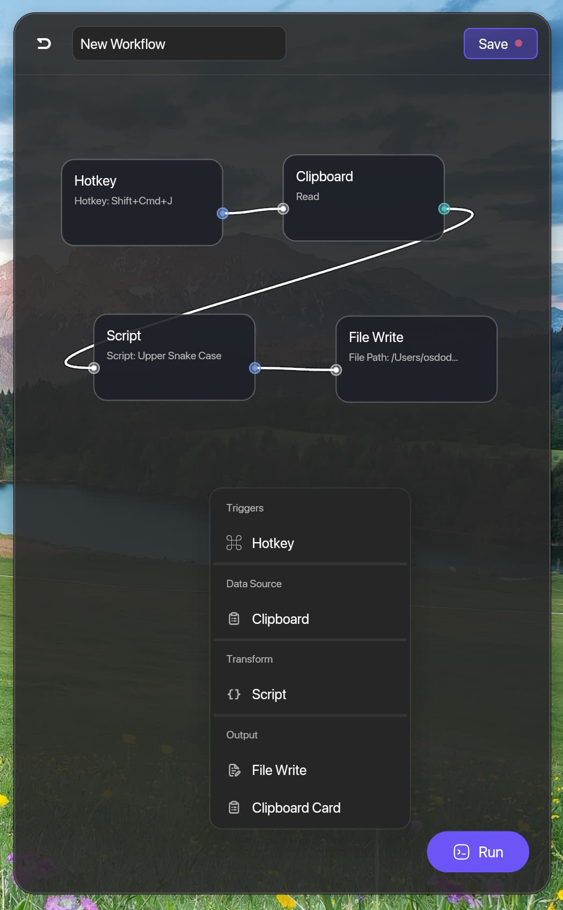
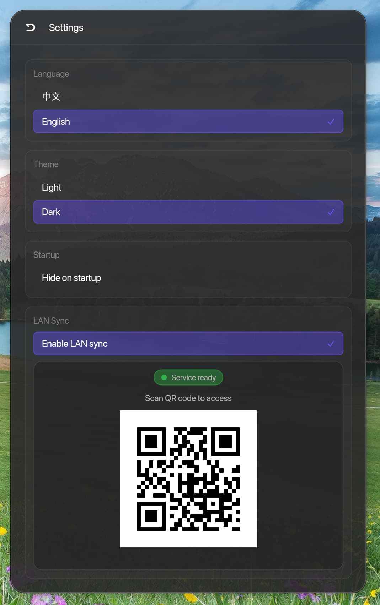

# Pastry

<p align="center">
  
  
  
</p>

Pastry 是一个剪贴板管理应用。它可以帮助你管理剪贴板历史、运行脚本并构建简单工作流。

## 核心功能

- **剪贴板历史**：保存文本、富文本、图片
- **收藏夹**：固定常用项目
- **脚本处理**：使用 JavaScript 转换剪贴板内容
- **JSON 工具**：格式化 JSON 并支持 JSONPath 查询
- **颜色选择器**：识别并选择常见颜色格式
- **局域网同步**：通过局域网访问并同步剪贴板内容
- **工作流**：通过热键/脚本/剪贴板/文件节点搭建自动化
- **系统集成**：全局热键、托盘运行、启动选项、窗口置顶
- **个性化**：多语言支持与明暗主题

## 基本使用

- 复制内容后，通过全局热键打开 Pastry
- 点击历史记录项可再次复制或加入收藏
- 使用 `input` / `output` 在脚本中处理剪贴板内容
- 连接工作流节点并配置触发方式

## 文档

- [Script 详细说明](docs/SCRIPT_GUIDE.zh-CN.md)
- [Workflow 详细说明](docs/WORKFLOW_GUIDE.zh-CN.md)
- [Color Picker 详细说明](docs/COLOR_GUIDE.zh-CN.md)
- [局域网同步说明](docs/LAN_SYNC_GUIDE.zh-CN.md)
- [JSONPath 指南](docs/JSONPATH_GUIDE.zh-CN.md)

## 常见问题（macOS）

如果打开 `Pastry.app` 时提示“已损坏，无法打开。你应该将它移到废纸篓”，请在终端执行：

```bash
sudo xattr -r -d com.apple.quarantine /Applications/Pastry.app
```

执行后重新打开应用即可。

## 许可证

基于 GNU General Public License v3.0。
